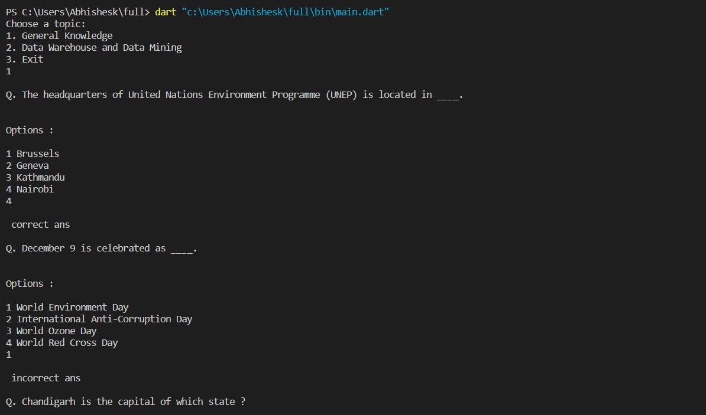
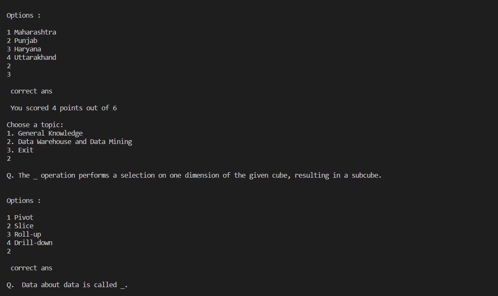
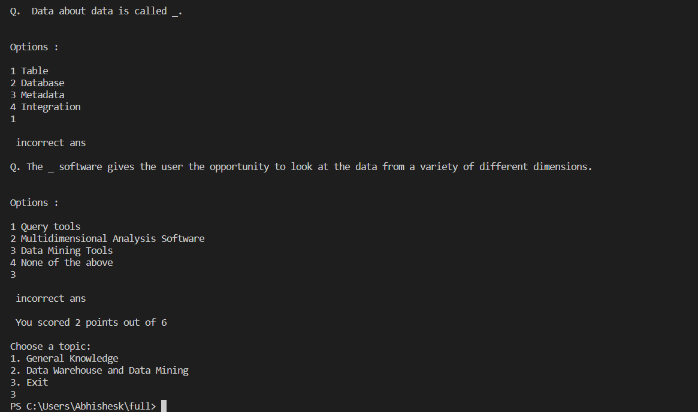

# Quiz (Console) App
A basic quiz console app that uses the fundamentals of dart language. The concepts used are Object-Oriented Programming (OOPs), Null-Safety, data-types, packages and inheritance.

## Features: 

- Multi-select option as answer.
- Questions are in randomised order.
- A message (correct/incorrect) is given after answering every question. 
- Score gets calculated.
- Quiz data is stored in another file
- User can take the quiz again on another topic or same question until he exits the quiz console app by giving 3 as input.

## Screenshots:

